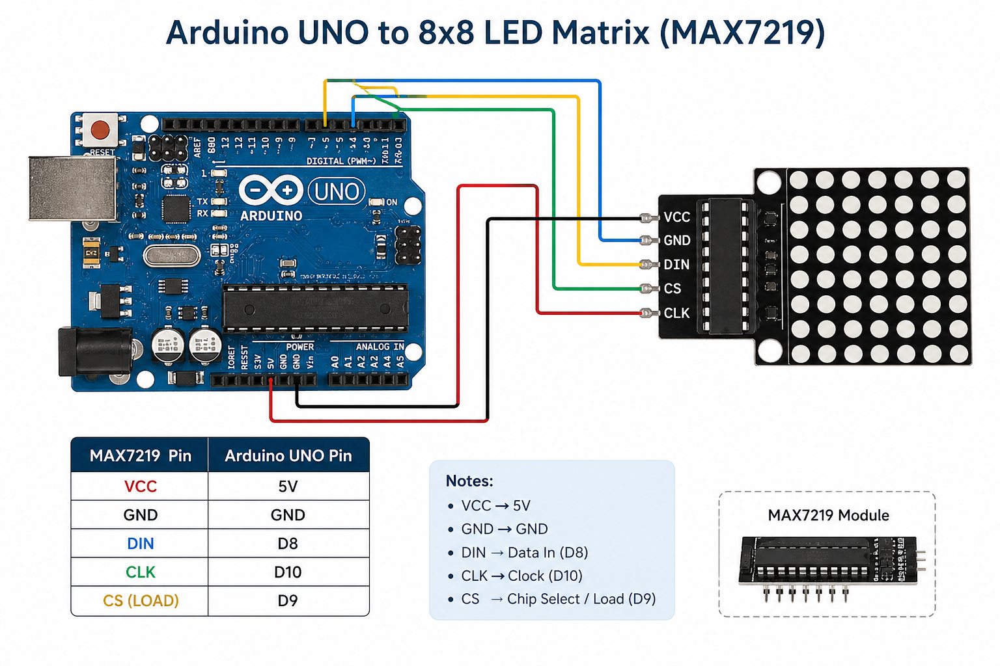
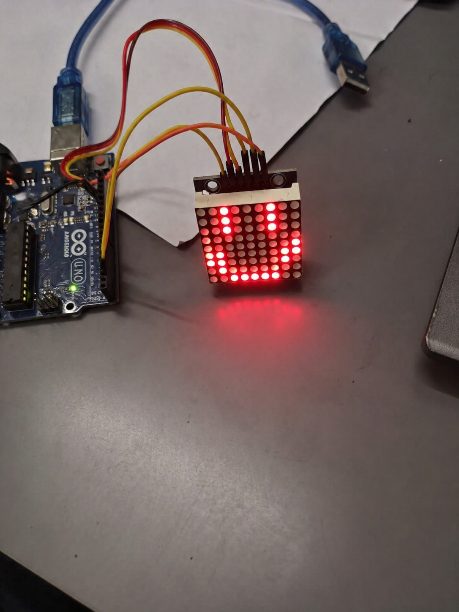

# 😊 8x8 LED Matrix Smiley Face using Arduino

## 📌 Overview

This project demonstrates how to display a **smiley face 😊** on an **8×8 LED matrix** using the **MAX7219 driver** and Arduino.

It is a beginner-friendly embedded systems project that helps you understand:

* SPI communication
* LED matrix control
* Binary pattern mapping

---

## 🎯 Objective

To display a predefined smiley pattern on an 8×8 LED matrix using Arduino.

---

## 🧰 Components Required

* Arduino Uno
* MAX7219 8×8 LED Matrix Module
* Jumper Wires
* Breadboard (optional)
* USB Cable

---

## 🔌 Circuit Connections

| MAX7219 Pin | Arduino Pin |
| ----------- | ----------- |
| VCC         | 5V          |
| GND         | GND         |
| DIN         | D8          |
| CLK         | D10         |
| CS (LOAD)   | D9          |

---

## 🖼️ Circuit Diagram



## 🖼️ 8x8 Matrix project 

---

## 💻 Arduino Code

```cpp
#include <LedControl.h>

// DIN, CLK, CS, number of devices
LedControl lc = LedControl(8, 10, 9, 1);

byte smile[8] = {
  0b00111100,
  0b01000010,
  0b10100101,
  0b10000001,
  0b10100101,
  0b10011001,
  0b01000010,
  0b00111100
};

void setup() {
  lc.shutdown(0, false);
  lc.setIntensity(0, 8);
  lc.clearDisplay(0);
}

void loop() {
  for (int i = 0; i < 8; i++) {
    lc.setRow(0, i, smile[i]);
  }
}
```

---

## ⚙️ Working Principle

* The MAX7219 controls the LED matrix using **SPI communication**.
* Arduino sends **row-wise binary data** using `lc.setRow()`.
* Each byte represents one row:

  * `1` → LED ON
  * `0` → LED OFF
* The smiley face is stored in an array and displayed row by row.

---

## ✅ Output

The LED matrix displays a **smiley face 😊**.


---

## ⚠️ Important Note

Ensure each binary value is **8-bit**.

❌ Incorrect:

```
0b000111100
```

✅ Correct:

```
0b00111100
```

---

## 🛠️ Troubleshooting

| Problem         | Solution                                            |
| --------------- | --------------------------------------------------- |
| No display      | Check wiring & power supply                         |
| Wrong pattern   | Verify binary values                                |
| Partial display | Ensure loop runs properly                           |
| Dim LEDs        | Increase brightness using `lc.setIntensity(0, 15);` |

---

## ⚡ Improvements

* Animate multiple patterns
* Display scrolling text
* Control via Bluetooth

---

## 📂 Project Structure

```
8x8_matrix_smiley/
│
├── code.ino
├── images/
│   ├── circuit.png
│   └── output.png
└── README.md
```

---

## 🤝 Contributing

Contributions are welcome!
Feel free to fork this repo and submit a pull request.

---

## 📜 License

This project is open-source and available under the MIT License.

---

## 👨‍💻 Author

**Utsab Ghosh**
Robotics Engineer | Embedded Systems | Arduino | Computer Vision

---
