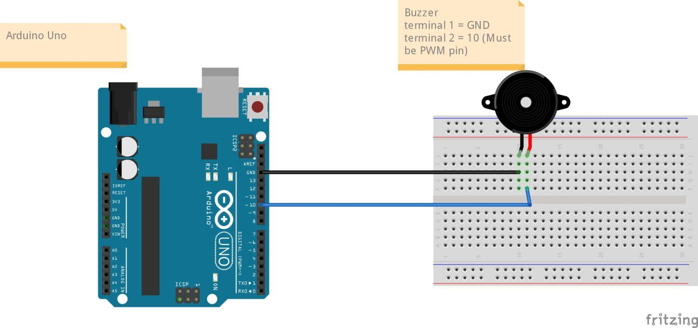

# 🔊 Buzzer Control using Arduino

## 📌 Overview

This project demonstrates how to use a **buzzer with Arduino** to generate sound.
Both **active buzzer (simple ON/OFF)** and **passive buzzer (tone generation)** are covered.

---

## 🎯 Objective

* Learn how to interface a buzzer with Arduino
* Generate sound signals using digital output
* Create tones using PWM (`tone()` function)

---

## 🧰 Components Required

* Arduino Uno
* Buzzer (Active or Passive)
* Jumper Wires
* Breadboard (optional)
* USB Cable

---

## 🔌 Circuit Connections

| Component  | Arduino Pin |
| ---------- | ----------- |
| Buzzer (+) | D8          |
| Buzzer (–) | GND         |

---

## 🖼️ Circuit Diagram



---

## 💻 Arduino Code

### 🔹 Active Buzzer

```cpp
int buzzerPin = 8;

void setup() {
  pinMode(buzzerPin, OUTPUT);
}

void loop() {
  digitalWrite(buzzerPin, HIGH);
  delay(1000);

  digitalWrite(buzzerPin, LOW);
  delay(1000);
}
```

---

### 🔹 Passive Buzzer

```cpp
int buzzerPin = 8;

void setup() {
}

void loop() {
  tone(buzzerPin, 1000);
  delay(500);

  tone(buzzerPin, 2000);
  delay(500);

  noTone(buzzerPin);
  delay(1000);
}
```

---

## ⚙️ Working Principle

* **Active buzzer**: produces sound when HIGH signal is applied
* **Passive buzzer**: requires frequency input using `tone()`
* Arduino controls buzzer using digital signals

---

## ⚠️ Important Notes

* Check buzzer type (active vs passive)
* Ensure correct polarity (+ / –)
* Avoid long continuous HIGH signal (can overheat buzzer)

---

## 🚀 Applications

* Alarm systems
* Notification systems
* Embedded alerts
* Robotics feedback

---

## 📂 Project Structure

```
buzzer/
│
├── code.ino
├── images/
│   └── circuit.png
└── README.md
```

---

## 👨‍💻 Author

**Utsab Ghosh**
Robotics Engineer
