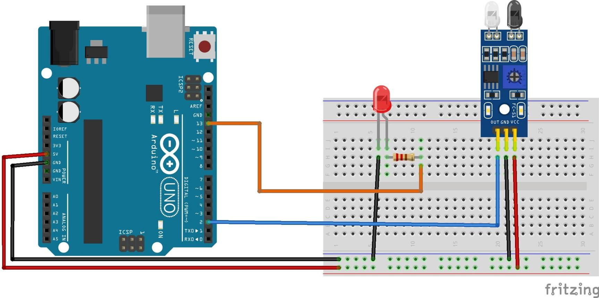

# 🔍 IR Sensor Object Detection using Arduino

## 📌 Overview

This project demonstrates how to detect the presence of an object using an **IR (Infrared) sensor** and indicate detection using an **LED** and the **Serial Monitor**.

---

## 🎯 Objective

To detect objects using an IR sensor and provide visual (LED) and serial feedback.

---

## 🧰 Components Required

* Arduino UNO (or compatible board)
* IR Sensor Module
* Red LED
* 220Ω Resistor
* Breadboard
* Jumper Wires
* USB Cable

---

## ⚙️ Working Principle

* The IR sensor emits infrared light.
* When an object is present, the light reflects back.
* The sensor detects this reflection and outputs:

  * `LOW (0)` → Object detected
  * `HIGH (1)` → No object

### 🔔 Based on output:

* LED ON → Object detected
* LED OFF → No object

---

## 🔌 Circuit Connections

### 🔹 IR Sensor

| IR Sensor Pin | Arduino Pin |
| ------------- | ----------- |
| VCC           | 5V          |
| GND           | GND         |
| OUT           | D2          |

### 🔹 LED

| LED Pin     | Arduino Pin            |
| ----------- | ---------------------- |
| Anode (+)   | D3 (via 220Ω resistor) |
| Cathode (-) | GND                    |

---

## 🖼️ Circuit Diagram



---

## 💻 Arduino Code

```cpp id="y3g6s1"
int irPin = 2;
int redLed = 3;

void setup(){
  pinMode(irPin, INPUT);
  pinMode(redLed, OUTPUT);
  Serial.begin(9600);
}

void loop(){
  int val = digitalRead(irPin);
  Serial.println(val);

  if(val == 0){
    Serial.println("Object Detected");
    digitalWrite(redLed, HIGH);
  }
  else{
    Serial.println("No Object Detected");
    digitalWrite(redLed, LOW);
  }

  delay(1000);
}
```

---

## ▶️ Procedure

1. Connect all components as per the circuit diagram
2. Open Arduino IDE
3. Paste the code
4. Select correct board and COM port
5. Upload the code
6. Open Serial Monitor (9600 baud rate)
7. Place an object in front of the IR sensor
8. Observe the output

---

## ✅ Output

* Object detected → LED ON + Serial Monitor shows **"Object Detected"**
* No object → LED OFF + Serial Monitor shows **"No Object Detected"**

---

## ⚠️ Notes / Tips

* Works best at short distances (2–30 cm)
* Adjust sensor potentiometer for sensitivity
* Avoid strong sunlight interference
* Some IR sensors output **LOW when detecting object**

---

## 🚀 Applications

* Obstacle detection robots
* Automatic doors
* Object counting systems
* Line-following robots

---

## 📂 Project Structure

```id="lq7h2p"
ir_sensor_project/
│
├── code.ino
├── images/
│   └── circuit.png
└── README.md
```

---

## 👨‍💻 Author

**Utsab Ghosh**
Robotics Engineer | Embedded Systems
