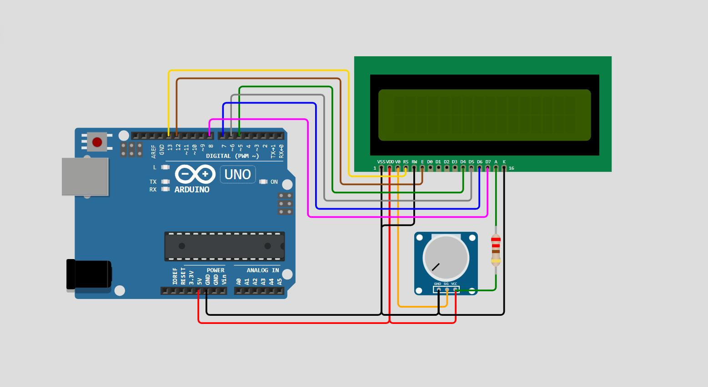

# 📺 Display "Hello World" on 16x2 LCD using Arduino

## 📌 Overview

This project displays **"Hello World"** on a **16x2 LCD** using Arduino.
A **10kΩ potentiometer is REQUIRED** to control display contrast.

---

## 🎯 Objective

To interface a 16x2 LCD with Arduino and display text correctly.

---

## 🧰 Components Required

* Arduino Uno
* 16x2 LCD (HD44780)
* ⚠️ 10kΩ Potentiometer (**MANDATORY**)
* Breadboard
* Jumper Wires
* USB Cable

---

## ⚠️ IMPORTANT (Must Read)

👉 Without potentiometer:

* LCD may show **blank screen**
* Or **black boxes only**

👉 The potentiometer adjusts **contrast**, not brightness.

---

## 🔌 Circuit Connections

### LCD → Arduino

| LCD Pin | Arduino              |
| ------- | -------------------- |
| VSS     | GND                  |
| VDD     | 5V                   |
| V0      | Potentiometer Middle |
| RS      | D12                  |
| RW      | GND                  |
| E       | D11                  |
| D4      | D5                   |
| D5      | D4                   |
| D6      | D3                   |
| D7      | D2                   |
| A       | 5V                   |
| K       | GND                  |

---

### Potentiometer

* Left → 5V
* Right → GND
* Middle → LCD V0

---

## 🖼️ Circuit Diagram



---

## 💻 Arduino Code

```cpp
#include <LiquidCrystal.h>

LiquidCrystal lcd(12, 11, 5, 4, 3, 2);

void setup(){
  lcd.begin(16, 2);
  lcd.setCursor(0, 0);
  lcd.print("Hello World");
}

void loop(){
}
```

---

## ⚙️ Working Principle

* LCD uses 4-bit communication (D4–D7)
* Arduino sends data via `lcd.print()`
* Potentiometer adjusts voltage at V0 → controls visibility

---

## ✅ Output

LCD displays:

Hello World

---

## 🛠️ Troubleshooting

| Problem      | Solution                  |
| ------------ | ------------------------- |
| Blank screen | Adjust potentiometer      |
| Black boxes  | Contrast issue            |
| Flickering   | Remove `lcd.clear()` loop |
| No backlight | Check pins 15 & 16        |

---

## 🚀 Applications

* Display panels
* Sensor output display
* Menu systems

---

## 👨‍💻 Author

Utsab Ghosh
Robotics Engineer
