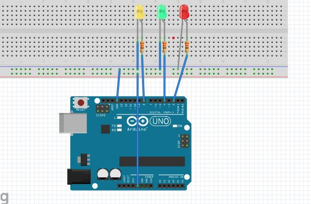

# 💡 Sequential Blinking of LEDs using Arduino

## 📌 Overview

This project demonstrates how to control **three LEDs (Blue, Red, White)** using Arduino and make them glow **sequentially**.

---

## 🎯 Objective

To create a sequential lighting effect by turning ON one LED at a time using Arduino.

---

## 🧰 Components Required

* Arduino Uno
* 3 LEDs (Blue, Red, White)
* 3 × 220Ω Resistors
* Breadboard
* Jumper Wires
* USB Cable

---

## 🔌 Circuit Connections

### 🔹 LED Connections

| LED Color | Arduino Pin | Connection                                    |
| --------- | ----------- | --------------------------------------------- |
| Blue LED  | D2          | Anode → D2, Cathode → GND (via 220Ω resistor) |
| Red LED   | D3          | Anode → D3, Cathode → GND (via 220Ω resistor) |
| White LED | D4          | Anode → D4, Cathode → GND (via 220Ω resistor) |

---

## 🖼️ Circuit Diagram



---

## 💻 Arduino Code

```cpp id="k92d7f"
int blue_pin = 2;
int red_pin = 3;
int white_pin = 4;

void setup(){
  pinMode(blue_pin, OUTPUT);  
  pinMode(red_pin, OUTPUT);
  pinMode(white_pin, OUTPUT);
}

void loop(){
  digitalWrite(blue_pin, HIGH);
  digitalWrite(red_pin, LOW);
  digitalWrite(white_pin, LOW);
  delay(1000);

  digitalWrite(blue_pin, LOW);
  digitalWrite(red_pin, HIGH);
  digitalWrite(white_pin, LOW);
  delay(1000);

  digitalWrite(blue_pin, LOW);
  digitalWrite(red_pin, LOW);
  digitalWrite(white_pin, HIGH);
  delay(1000);
}
```

---

## ⚙️ Working Principle

* Each LED is connected to a separate Arduino digital pin
* Arduino turns ON one LED at a time using `HIGH`
* Other LEDs remain OFF (`LOW`)
* A delay of 1 second creates a visible sequence
* The loop repeats continuously

---

## ✅ Output

* Blue LED glows for 1 second
* Then Red LED glows for 1 second
* Then White LED glows for 1 second
* Sequence repeats continuously

---

## ⚠️ Precautions

* Always use a **220Ω resistor** with each LED
* Ensure correct LED polarity:

  * Long leg → Positive (Anode)
  * Short leg → Negative (Cathode)
* Check wiring before powering
* Use stable 5V supply

---

## 🛠️ Troubleshooting

| Problem            | Solution                    |
| ------------------ | --------------------------- |
| LED not glowing    | Check polarity and wiring   |
| Only one LED works | Verify pin connections      |
| LEDs dim           | Use proper resistor (~220Ω) |
| No output          | Check code upload & port    |

---

## 🚀 Improvement Ideas

* Reduce delay for faster blinking
* Add more LEDs for patterns
* Create **running light effect 🚦**
* Use `analogWrite()` for brightness control

---

## 📂 Project Structure

```id="9pz71r"
sequential_leds/
│
├── code.ino
├── images/
│   └── circuit.png
└── README.md
```

---

## 👨‍💻 Author

**Utsab Ghosh**
Robotics Engineer | Embedded Systems
