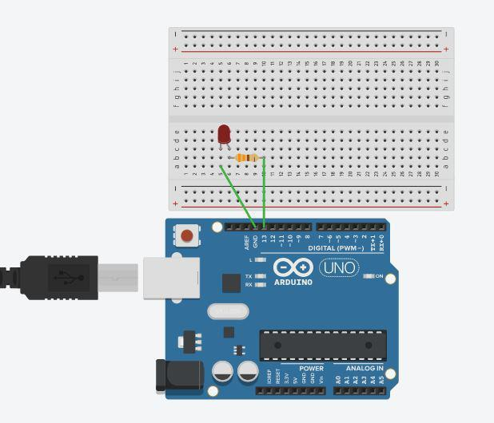

# 🧾 STANDARD OPERATING PROCEDURE (SOP)

## 💡 Blinking an LED using Arduino

---

## 1. 🎯 Objective

To blink an LED ON and OFF at a fixed interval using an Arduino Uno.

---

## 2. 🧰 Components Required

* Arduino Uno
* LED
* 220Ω Resistor
* Breadboard
* Jumper Wires
* USB Cable

---

## 3. 🖼️ Circuit Diagram




---

## 4. 🔌 Circuit Connections

* LED Anode (long leg) → Arduino pin 2
* LED Cathode (short leg) → GND (through 220Ω resistor)

---

## 5. 💻 Arduino Program

```cpp
int led_pin = 2;

void setup(){
  pinMode(led_pin, OUTPUT);  
}

void loop(){
  digitalWrite(led_pin, HIGH);
  delay(1000);

  digitalWrite(led_pin, LOW);
  delay(1000);
}
```

---

## 6. ⚙️ Working Principle

* The LED is connected to a digital output pin of the Arduino
* `digitalWrite(HIGH)` turns the LED ON
* `digitalWrite(LOW)` turns the LED OFF
* A delay of 1 second is used between ON and OFF states
* This creates a continuous blinking effect

---

## 7. ✅ Output

* LED turns ON for 1 second
* LED turns OFF for 1 second
* The cycle repeats continuously

---

## 8. ⚠️ Precautions

* Always use a **220Ω resistor** to protect the LED
* Ensure correct LED polarity:

  * Long leg → Positive
  * Short leg → Negative
* Check all wiring connections
* Use proper 5V power supply

---

## 9. 🛠️ Troubleshooting

| Problem         | Solution                      |
| --------------- | ----------------------------- |
| LED not glowing | Check polarity and wiring     |
| LED always ON   | Check code upload             |
| No output       | Verify Arduino port and cable |

---

## 🔥 Improvement Ideas

* Change delay to control blinking speed
* Use multiple LEDs
* Add push button control
* Use PWM for fading effect

---

## 👨‍💻 Author

**Utsab Ghosh**
Robotics Engineer
