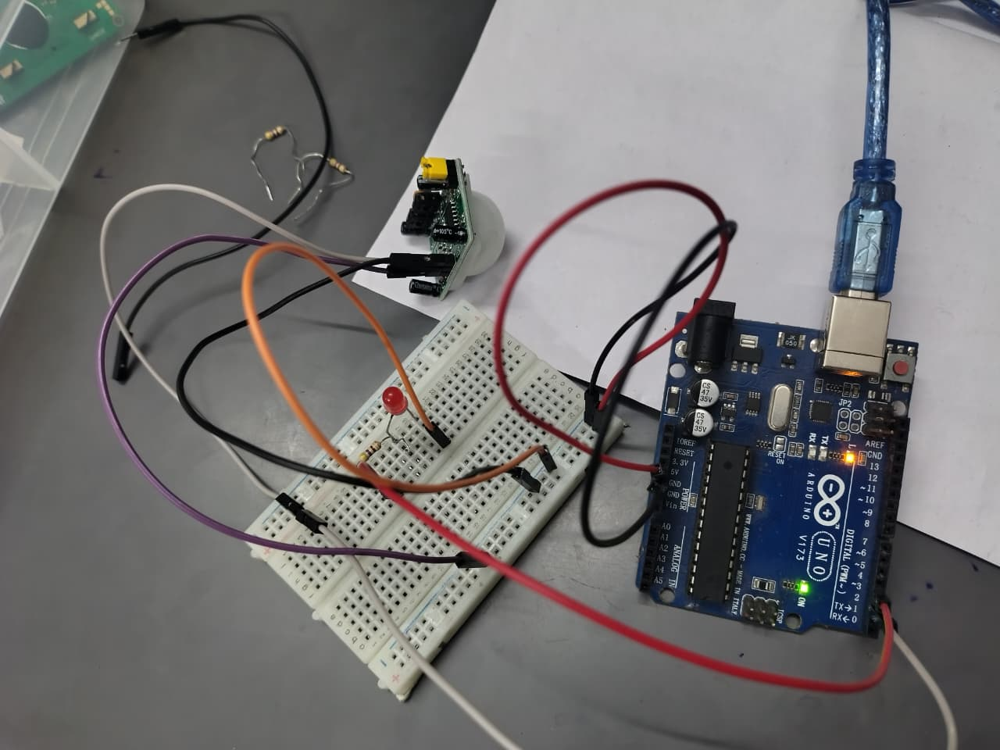

# 🧾 STANDARD OPERATING PROCEDURE (SOP)

## 🚶 Motion Detection using PIR Sensor and Arduino

---

## 1. 🎯 Objective

To detect motion using a PIR sensor and control an LED using an Arduino Uno while displaying the motion status on the Serial Monitor.

---

## 2. 🧰 Components Required

* Arduino Uno
* PIR Motion Sensor (HC-SR501 or similar)
* LED
* 220Ω Resistor
* Breadboard
* Jumper Wires
* USB Cable

---

## 3. 🖼️ Circuit Diagram

*(Add your circuit image here)*

```md

```

---

## 4. 🔌 Circuit Connections

### PIR Sensor Connections

* VCC → Arduino 5V
* GND → Arduino GND
* OUT → Arduino pin 2

### LED Connections

* LED Anode (+) → Arduino pin 3
* LED Cathode (-) → GND through 220Ω resistor

---

## 5. 💻 Arduino Program

```cpp
int pir_output = 2;
int led_pin = 3;

void setup(){
  pinMode(pir_output, INPUT);
  pinMode(led_pin, OUTPUT);
  Serial.begin(9600);
}

void loop(){
  int res = digitalRead(pir_output);

  if(res == 1){
    Serial.println("Motion detected");
    digitalWrite(led_pin, HIGH);
  }
  else{
    Serial.println("No Motion detected");
    digitalWrite(led_pin, LOW);
  }

  delay(1000);
}
```

---

## 6. ⚙️ Working Principle

* The PIR sensor detects changes in infrared radiation caused by human movement
* When motion is detected, the sensor outputs HIGH (1)
* Arduino reads the sensor signal using `digitalRead()`
* If motion is detected:
  * LED turns ON
  * Serial Monitor displays `"Motion detected"`
* If no motion is detected:
  * LED turns OFF
  * Serial Monitor displays `"No Motion detected"`

---

## 7. ✅ Output

* Motion detected → LED turns ON
* No motion detected → LED turns OFF
* Serial Monitor displays motion status continuously

---

## 8. ⚠️ Precautions

* Ensure correct PIR sensor connections:
  * VCC
  * GND
  * OUT
* Wait 30–60 seconds after powering the PIR sensor for stabilization
* Always use a **220Ω resistor** with the LED
* Avoid placing the sensor near heat sources or direct sunlight
* Check proper wiring before powering the circuit

---

## 9. 🛠️ Troubleshooting

| Problem | Solution |
|---|---|
| Sensor not detecting motion | Wait for stabilization and adjust sensitivity |
| LED always ON | Adjust sensitivity/delay knobs on PIR sensor |
| No Serial output | Check baud rate (9600) and COM port |
| False triggering | Reduce sensitivity or reposition the sensor |

---

## 🔥 Extra Tips

* PIR sensors usually have 2 knobs:
  * Sensitivity Adjustment
  * Delay Time Adjustment
* You can remove `delay(1000)` for faster response
* Open Serial Monitor at **9600 baud rate**
* Place the sensor at a proper height for better detection

---

## 🚀 Applications

* Home Security Systems
* Automatic Room Lights
* Motion Alarm Systems
* Smart Home Automation
* Energy Saving Systems

---

## 👨‍💻 Author

**Utsab Ghosh**  
Robotics Engineer
