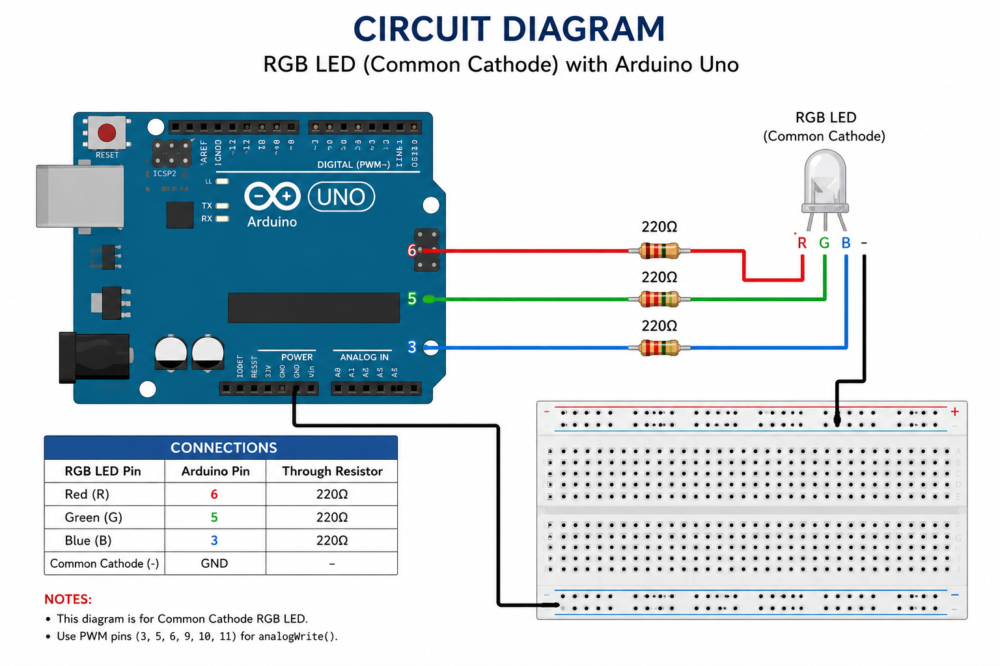

# 🌈 RGB LED Color Cycling using Arduino

## 🧾 STANDARD OPERATING PROCEDURE (SOP)

---

## 1. 🎯 Objective

To control an RGB LED using Arduino Uno and display different colors in sequence using PWM pins.

---

## 2. 🧰 Components Required

* Arduino Uno
* RGB LED (Common Cathode)
* 220Ω Resistors × 3
* Breadboard
* Jumper Wires
* USB Cable

---

## 3. 🖼️ Circuit Diagram

```md

```

---

## 4. 🔌 Circuit Connections

| RGB LED Pin | Arduino Pin | Through Resistor |
|---|---|---|
| Red (R) | Pin 6 | 220Ω |
| Green (G) | Pin 5 | 220Ω |
| Blue (B) | Pin 3 | 220Ω |
| Common Cathode (-) | GND | — |

---


---

## 6. ⚙️ Working Principle

* RGB LED contains Red, Green, and Blue LEDs inside a single package
* PWM pins are used to control brightness of each color
* `analogWrite()` accepts values from 0–255
* Different color combinations are created by varying RGB intensity
* The program cycles through multiple colors automatically

---

## 7. ✅ Output

The RGB LED changes colors in the following sequence:

* Red
* Green
* Blue
* Yellow
* Purple
* White

Each color stays ON for 1 second.

---

## 8. ⚠️ Precautions

* Use 220Ω resistors to protect the RGB LED
* Ensure correct RGB LED pin configuration
* Verify whether your RGB LED is:
  * Common Cathode
  * Common Anode
* Use only PWM-supported pins for `analogWrite()`
* Check all wiring before powering the circuit

---

## 9. 🛠️ Troubleshooting

| Problem | Solution |
|---|---|
| Wrong colors appearing | Check RGB pin connections |
| LED not glowing | Verify common pin connection |
| Very dim colors | Check resistor values |
| No output | Re-upload code and check USB connection |

---

## 🔥 Improvement Ideas

* Add smooth fading effects
* Control colors using Bluetooth
* Add push button color selection
* Create rainbow animation effects
* Use potentiometer for brightness control

---

## 🚀 Applications

* Decorative Lighting
* Mood Lamps
* Smart Lighting Systems
* DIY Electronics Projects
* Arduino Learning Projects

---

## 👨‍💻 Author

**Utsab Ghosh**  
Robotics Engineer