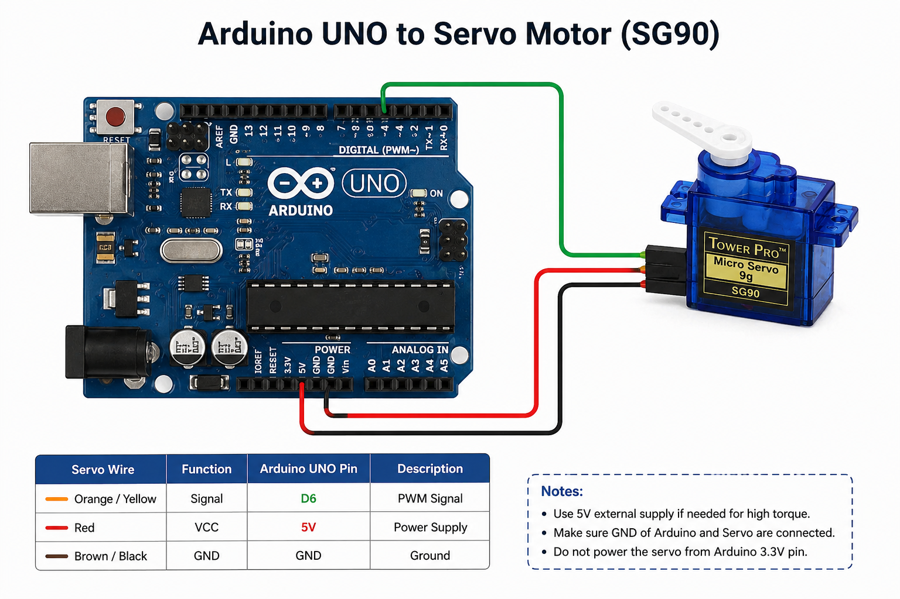

# 🔄 Servo Motor Control using Arduino (0°–180° Sweep)

## 📌 Overview

This project demonstrates how to control a **servo motor** using Arduino.
The servo rotates between **0°, 90°, and 180°** with a delay of 1 second.

---

## 🎯 Objective

To understand how to:

* Interface a servo motor with Arduino
* Control angular position using code

---

## 🧰 Components Required

* Arduino Uno
* Servo Motor (SG90 / MG90S)
* Jumper Wires
* Breadboard (optional)
* USB Cable

---

## 🔌 Circuit Connections

| Servo Wire             | Arduino Pin |
| ---------------------- | ----------- |
| Red (VCC)              | 5V          |
| Brown/Black (GND)      | GND         |
| Orange/Yellow (Signal) | D6          |

---

## 🖼️ Circuit Diagram



---

## 💻 Arduino Code

```cpp
#include <Servo.h>

int pin = 6;
Servo myServo;

void setup(){
  myServo.attach(pin);
}

void loop(){
  myServo.write(0);
  delay(1000);

  myServo.write(90);
  delay(1000);

  myServo.write(180);
  delay(1000);
}
```

---

## ⚙️ Working Principle

* Servo motor works using PWM signals
* Arduino sends angle values using `myServo.write()`
* Servo rotates to:

  * 0° → wait 1 sec
  * 90° → wait 1 sec
  * 180° → wait 1 sec
* This loop repeats continuously

---

## ⚠️ Important Notes

* Use stable **5V supply**
* Do NOT use 3.3V for servo
* Ensure **common ground**

---

## 🚀 Applications

* Robotic arms
* Camera pan-tilt systems
* Automation projects

---

## 📂 Project Structure

```
servo_motor/
│
├── code.ino
├── images/
│   └── circuit.png
└── README.md
```

---

## 👨‍💻 Author

**Utsab Ghosh**
Robotics Engineer
