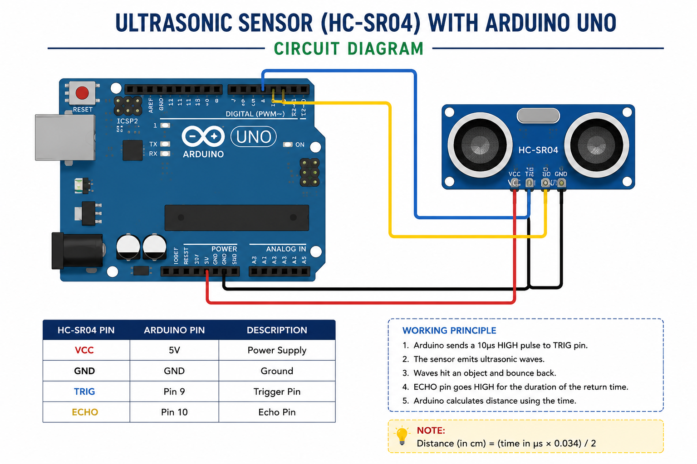

# 📏 Ultrasonic Sensor Distance Measurement using Arduino

## 🧾 STANDARD OPERATING PROCEDURE (SOP)

---

## 1. 🎯 Objective

To measure distance using an HC-SR04 Ultrasonic Sensor with Arduino Uno and display the measured distance on the Serial Monitor.

---

## 2. 🧰 Components Required

* Arduino Uno
* HC-SR04 Ultrasonic Sensor
* Breadboard
* Jumper Wires
* USB Cable

---

## 3. 🖼️ Circuit Diagram





---

## 4. 🔌 Circuit Connections

| Ultrasonic Sensor Pin | Arduino Pin |
|---|---|
| VCC | 5V |
| GND | GND |
| TRIG | Pin 9 |
| ECHO | Pin 10 |

---

## 5. 💻 Arduino Program

```cpp
int trig_pin = 9;
int echo_pin = 10;

long duration;
float distance;

void setup() {
  pinMode(trig_pin, OUTPUT);
  pinMode(echo_pin, INPUT);

  Serial.begin(9600);
}

void loop() {

  digitalWrite(trig_pin, LOW);
  delayMicroseconds(2);

  digitalWrite(trig_pin, HIGH);
  delayMicroseconds(10);
  digitalWrite(trig_pin, LOW);

  duration = pulseIn(echo_pin, HIGH);

  distance = (duration * 0.034) / 2;

  Serial.print("Distance: ");
  Serial.print(distance);
  Serial.println(" cm");

  delay(500);
}
```

---

## 6. ⚙️ Working Principle

* The HC-SR04 sensor sends ultrasonic sound waves using the TRIG pin
* The sound waves hit an object and bounce back
* The ECHO pin receives the reflected sound wave
* Arduino measures the travel time using `pulseIn()`
* Distance is calculated using:

:contentReference[oaicite:0]{index=0}

* `0.034 cm/µs` is the speed of sound
* Division by 2 is done because the sound travels to the object and back

---

## 7. ✅ Output

* Serial Monitor displays the measured distance in centimeters
* Distance updates every 0.5 seconds

Example:

```text
Distance: 15.34 cm
Distance: 14.91 cm
Distance: 16.02 cm
```

---

## 8. ⚠️ Precautions

* Ensure proper TRIG and ECHO pin connections
* Keep the sensor facing the object directly
* Avoid obstacles that absorb sound
* Do not place the sensor near very soft materials
* Ensure stable 5V power supply

---

## 9. 🛠️ Troubleshooting

| Problem | Solution |
|---|---|
| No distance reading | Check wiring connections |
| Constant 0 cm | Verify ECHO pin connection |
| Incorrect readings | Reduce environmental noise |
| Sensor not responding | Check power supply |

---

## 🔥 Improvement Ideas

* Add LCD display for distance
* Create obstacle avoiding robot
* Add buzzer alert for close objects
* Display distance on OLED screen
* Use servo motor for radar scanning

---

## 🚀 Applications

* Obstacle Avoiding Robots
* Distance Measurement Systems
* Water Level Monitoring
* Parking Sensors
* Robotics Projects

---

## 👨‍💻 Author

**Utsab Ghosh**  
Robotics Engineer